# Flussi — come funziona, dall'inizio alla fine

Diagrammi del funzionamento end-to-end. Contesto e scelte progettuali stanno in
[PROGETTO.md](PROGETTO.md); i comandi in [COMANDI.md](COMANDI.md).

**Legenda dei colori**, uguale in tutti i diagrammi:

| Colore | Cosa rappresenta |
|---|---|
| 🟩 verde | backend Python |
| 🟦 azzurro | frontend Angular |
| 🟨 ocra | dati a riposo (file, SQLite, indici) |
| 🟪 viola | il modello Gemini — l'unico pezzo non deterministico |
| 🟥 rosso | percorsi di errore, rifiuto, fallback |
| ⬜ grigio | decisioni |

---

## 1. Mappa generale

Tre processi. Il browser non parla mai con Gemini: la chiave sta solo nel backend,
e il modello non tocca mai il database — vede solo cinque funzioni.

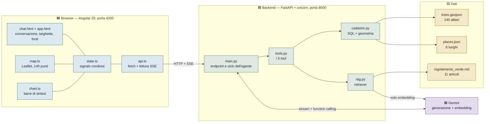

---

## 2. Avvio del backend — `lifespan`

Tutto il caricamento avviene una volta sola, all'avvio del processo. Il punto
importante è il bivio in fondo: se manca la chiave o l'API fallisce, il retriever
**non si rompe**, scende su BM25. È quello che rende i test eseguibili offline.

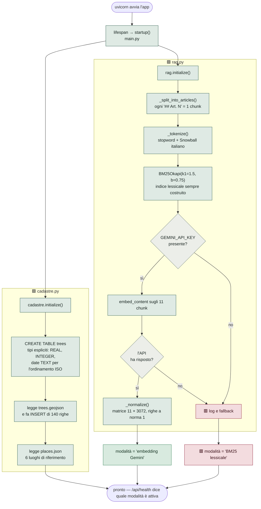

---

## 3. Avvio del frontend — perché il controllo di salute viene prima

`state.load()` non scarica i dati e basta: prima chiede *chi* risponde su quella
porta. Senza il controllo, un altro progetto in ascolto sulla 8000 produce errori
incomprensibili invece di dire qual è il problema.

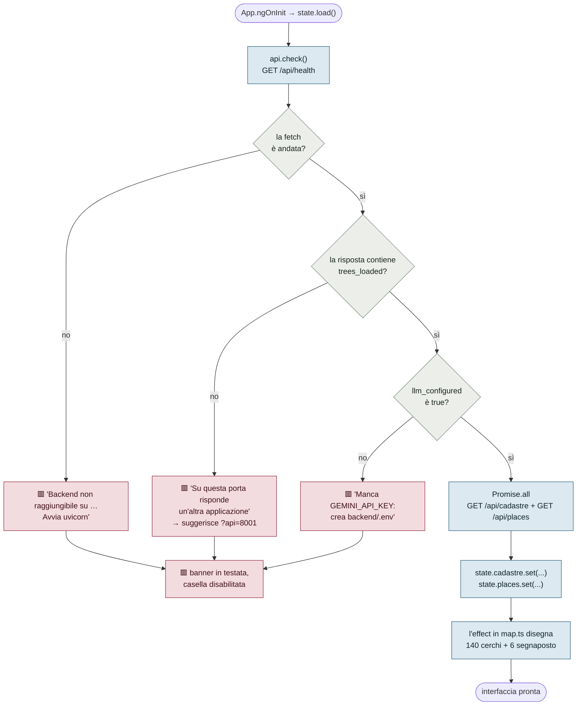

---

## 4. Una domanda, dall'inizio alla fine

È il diagramma centrale. Da notare tre cose: il ciclo dell'agente lo guidiamo
noi (AFC disabilitata), ogni chiamata a un tool produce **due** eventi in chat
(prima l'intenzione, poi l'esito), e le citazioni si calcolano **dopo** che il
testo è completo — perché solo allora si sa quali articoli il modello ha citato
davvero.

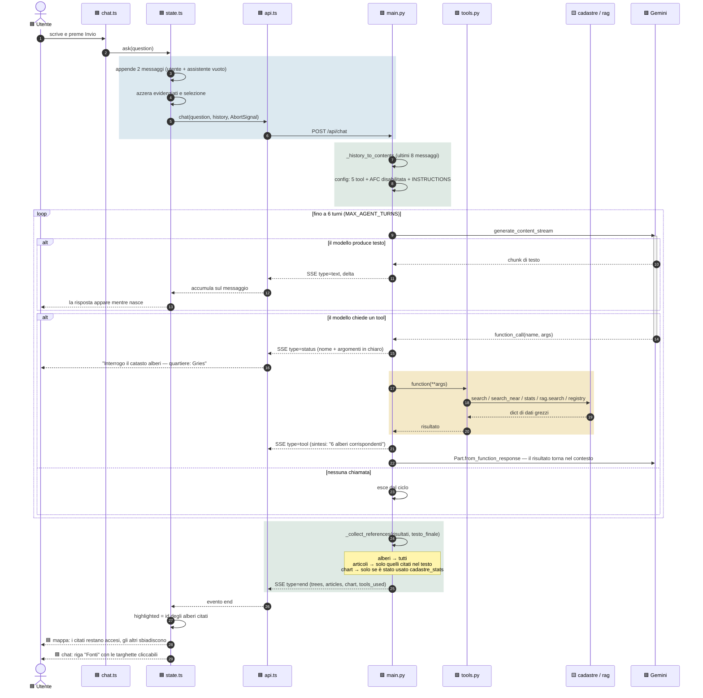

---

## 5. Il dispatch dei tool

Il modello non conosce SQL né il regolamento: conosce cinque firme di funzione,
costruite da Gemini leggendo **type hint e docstring** di `tools.py`. La docstring
lì è interfaccia, non commento.

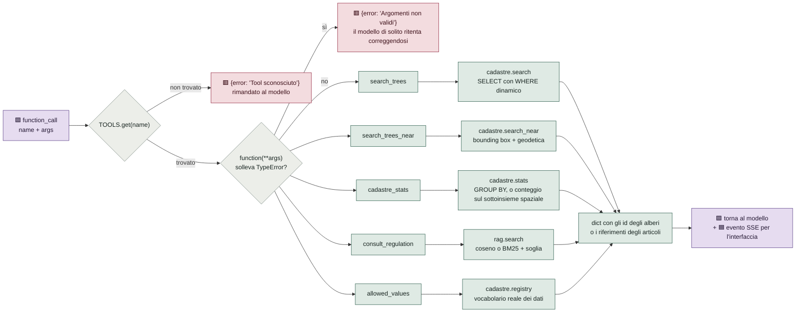

**Perché il vocabolario è un tool.** `allowed_values` esiste perché il modello,
davanti a un quartiere che non riconosce, ha due strade: indovinare o chiedere.
La regola 6 del prompt gli dice di chiedere, e questo tool è la risposta.

---

## 6. Il RAG, dal documento alla citazione

Due retriever dietro la stessa firma. La parte che conta non è il recupero: è la
**soglia assoluta**, che permette di non restituire niente.

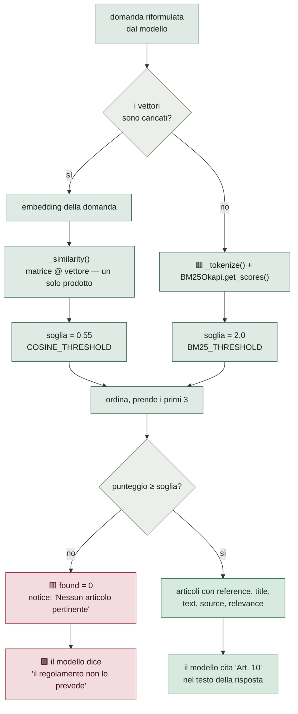

**Le soglie sono assolute, non relative al miglior risultato.** Normalizzando sul
massimo, il migliore vale sempre 1 e il sistema cita comunque l'articolo meno
peggio. Le due scale sono diverse, quindi le soglie sono due.

### Perché lo stemming conta

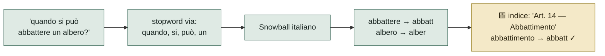

`STOP_WORDS` contiene anche `comunale`: non è una stopword dell'italiano, è una
stopword **di questo corpus**. Tutto il documento è il regolamento di un comune,
quindi quella parola non distingue un articolo dall'altro — e senza toglierla
*"gli orari della biblioteca comunale"* pescava l'Art. 1 e superava la soglia.

---

## 7. La query spaziale

Due stadi. Il primo è solo un'ottimizzazione, il secondo è la verità. L'invariante
del prefiltro è che non deve **mai** escludere un albero che la distanza esatta
accetterebbe — per questo usa il grado di latitudine al suo minimo (110 574 m) e
non quello medio.

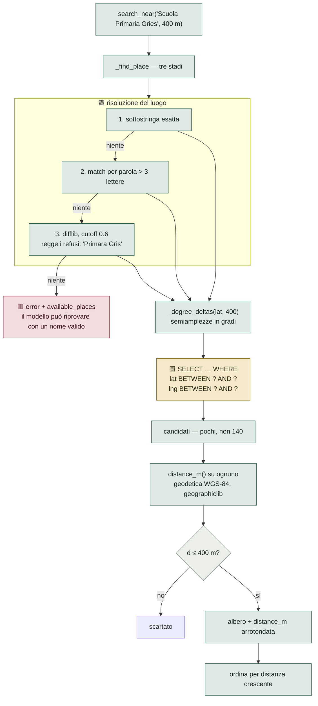

In produzione questo strato diventa PostGIS `ST_DWithin` senza toccare la firma
dei tool: il modello non se ne accorgerebbe.

---

## 8. Il filtro delle citazioni

Alberi e articoli seguono due regole **diverse**, e la differenza è deliberata.

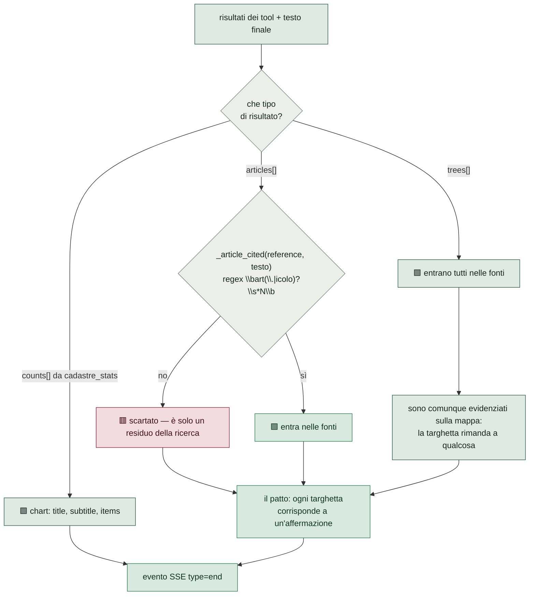

Un articolo recuperato ma non usato, mostrato fra le fonti, rompe il patto — e
insegna a non fidarsi neanche delle altre targhette. Il confine di parola nella
regex serve a non far pescare `Art. 5` da `Art. 50`.

---

## 9. I 429: due limiti che si somigliano e vanno trattati all'opposto

Gemini manda un `retryDelay` in **entrambi** i casi. Sul limite giornaliero dice
59 s, che è una promessa che non può mantenere. Il campo che li separa è il
`quotaId`.

Con più chiavi configurate (`GEMINI_API_KEYS`) la distinzione decide anche
**cosa farne della chiave**: il limite al minuto la mette in pausa, quello
giornaliero la toglie dal giro. In entrambi i casi la prima mossa non è
aspettare, è cambiare chiave — che costa zero secondi.

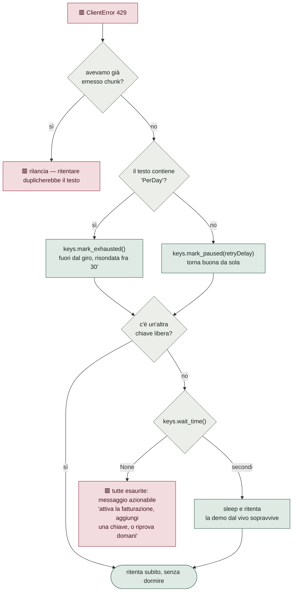

`wait_time()` guarda solo le pause brevi: sul limite giornaliero non si dorme
mai, perché mezz'ora di attesa e un errore, per chi ha appena fatto la domanda,
sono la stessa cosa.

La stessa distinzione serve alla suite di eval: un caso morto sulla quota non
dice **niente** sull'agente, quindi ha uno stato `SKIP` separato da `FAIL`.

---

## 10. Dallo stream SSE allo schermo

Cinque tipi di evento, ognuno con il suo effetto sull'interfaccia. Il buffer in
`api.ts` accumula finché non trova `\n\n`, perché un chunk di rete può spezzare
un JSON a metà.

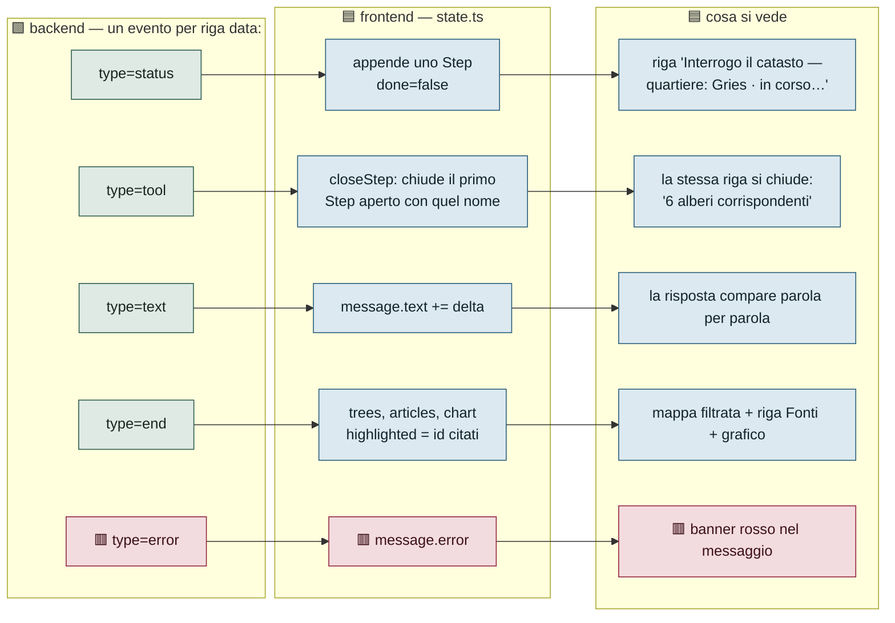

**Perché `closeStep` cerca il primo passo aperto con quel nome:** un tool può
essere chiamato più volte nella stessa risposta, e chiudere quello sbagliato
lascia in pagina una riga "in corso…" che non finisce mai.

---

## 11. Il patto chat ↔ mappa

La risposta e le feature sulla mappa sono la stessa cosa vista due volte. Il
puntamento va nei due sensi, e passa sempre dai signal condivisi — nessun
componente parla direttamente con l'altro.

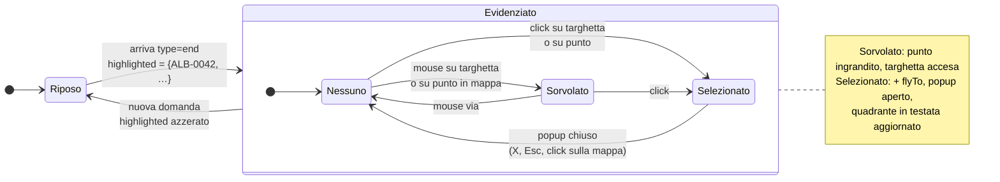

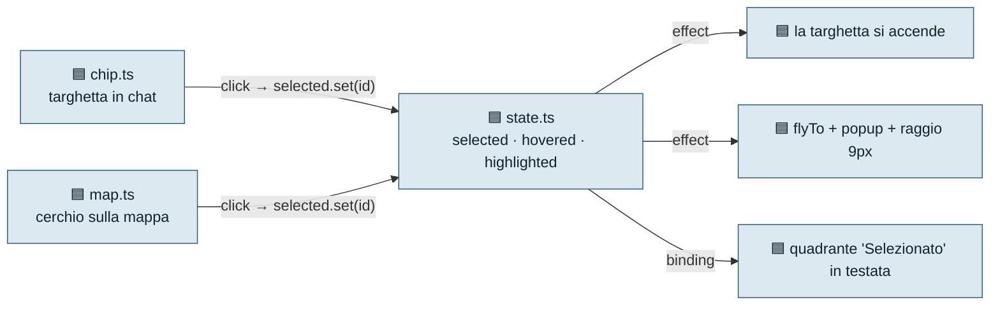

Il `popupclose` di Leaflet confronta il popup che si chiude con quello
dell'albero selezionato: senza quel confronto, aprire il popup di B chiude
quello di A e la selezione di B verrebbe cancellata nell'istante in cui nasce.

---

## 12. Il modello dei dati

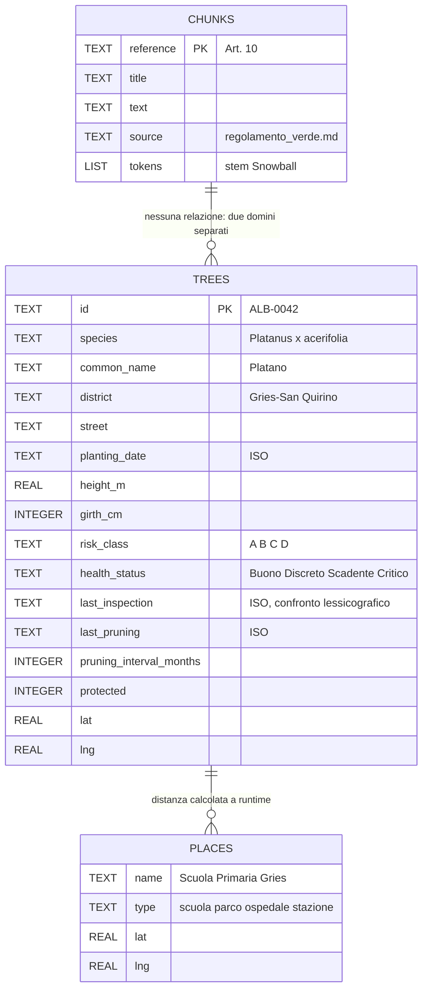

**Le date restano `TEXT` di proposito.** In formato ISO si ordinano e si
confrontano lessicograficamente, che è esattamente quello che serve a
`last_inspection < ?`. Il resto ha il suo tipo, così i valori tornano già
numerici da sqlite3.

I due campi calcolati — `months_since_inspection` e `months_since_pruning` — non
stanno nel DB: li aggiunge `_row_to_dict` con `relativedelta`, che tiene conto
del giorno (fra il 31 gennaio e il 1 febbraio è passato 0, non 1).

---

## 13. Le difese contro le allucinazioni

Non si eliminano: si stratificano. Ogni strato lascia passare qualcosa, e quello
sotto lo prende.

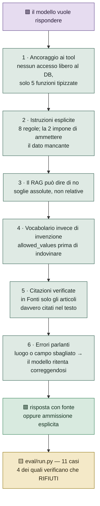

La quinta domanda della demo — *"qual è il valore economico degli alberi di
Oltrisarco?"* — è la più importante: è quella che dimostra che le prime quattro
sono affidabili.

---

## 14. Cosa copre quale test

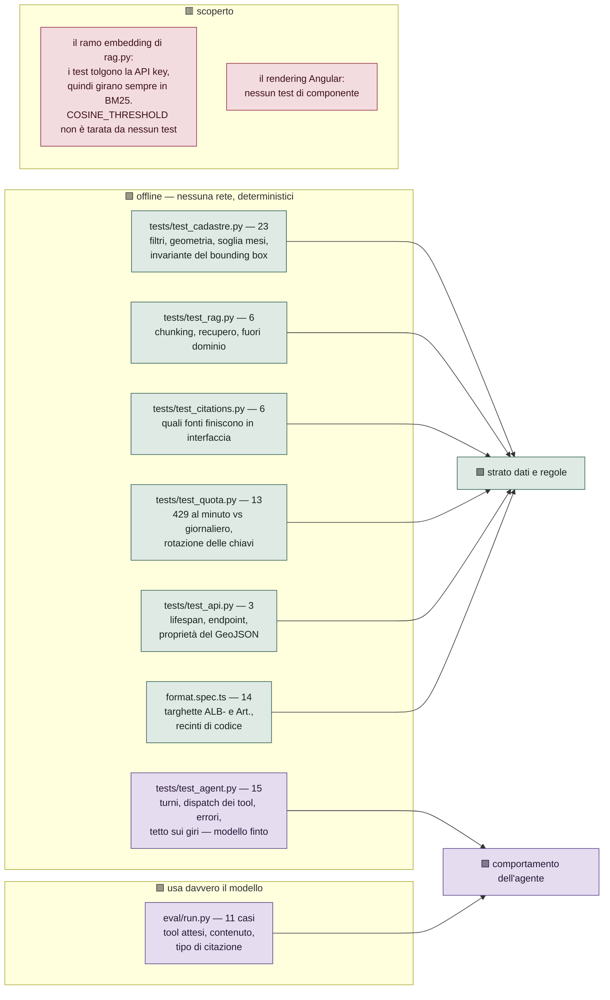

---

## 15. Riepilogo dei percorsi

| Domanda | Strada | Perché |
|---|---|---|
| "quanti tigli a Gries" | SQL | un conteggio deve essere esatto, non simile |
| "entro 400 m dalla scuola" | bounding box + geodetica WGS-84 | la geometria è geometria, non semantica |
| "ogni quanto si pota un platano" | embedding, o BM25 in fallback | qui la somiglianza di significato è il punto |
| "come sono distribuiti per classe" | GROUP BY + grafico disegnato dall'interfaccia | il modello non disegna, chiama `cadastre_stats` |
| "valore economico degli alberi" | nessun tool ha il dato | ammissione esplicita, nessuna citazione |
